name:portada
class: center, middle

.linea-superior[]
.linea-inferior[]


## INE Educa: Clases abiertas de R

## Git para usuarios de R

## Proyecto Ciencia de Datos

### Diciembre 2023


```{r setup, include=FALSE}
options(htmltools.dir.version = FALSE)
knitr::opts_chunk$set(message = FALSE) 
```

```{r xaringan-themer, include=FALSE, warning=FALSE}
library(xaringanthemer)
#style_duo_accent(
 # primary_color = "#1381B0",
  #secondary_color = "#FF961C",
  #inverse_header_color = "#FFFFFF"
#)
```


---
name:diapo-basica
background-image: url("imagenes/fondo2.PNG")
background-size: contain;
background-position: 100% 0%

---
template:diapo-basica

# Bienvenidas y bienvenidos

.center[

]


---
template:diapo-basica


# Contenidos de la clase


.body2[
- ¿Qué es Git y para qué sirve?
- Principales conceptos asociados a Git
- Esquema de trabajo en git
- Conflictos de merge
- Árbol de commits
- Uso de ramas
- El .gitignore
- Casos de uso
- Recomendaciones sobre uso de git]

--

**Objetivo de la clase**

- Habilitar en el uso básico de git (git clone, git push, git pull) en conjunto con la herramienta Rstudio

---
template:diapo-basica

# Contenidos de la clase


**.red[MUY IMPORTANTE:]** 

- La clase no está pensada para ser seguida en vivo. Se recomienda hacerlo cuando 
sea subida a las redes sociales del INE.

--

- Se recomienda seguir la clase desde computadores personales, pues plataformas como `GitHub` suelen estar
sujetas a bloqueos institucionales.

--

- La clase se realizará utilizando `GitHub` como plataforma de control de versiones. Es necesario crear una
cuenta cuando para seguir la clase.
  - Otras alternativas: `Gitlab`, `Bitbucket`.


---

template:diapo-basica


# ¿Qué es Git y para qué sirve?

.center[

]

---

template:diapo-basica


# ¿Qué es Git y para qué sirve?

.center[
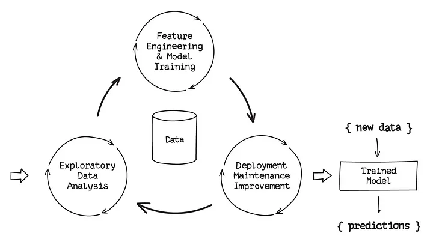
]


<!-- --- -->

<!-- template:diapo-basica -->


<!-- # ¿Qué es Git y para qué sirve? -->

<!-- ## Breve historia -->


---

template:diapo-basica


# ¿Qué es Git y para qué sirve?

Es un sistema de control de versiones (VCS).

Funciona como una máquina del tiempo 

- Cada cierto tiempo sacamos una "foto" del estado de todos los archivos del proyecto

- Estas fotos no desaparecen

- Siempre es posible volver a una foto anterior

Además, nos dice quién hizo qué y cuándo en  nuestro proyecto  

Permite que varias personas trabajen en un mismo proyecto sin molestarse unos a otros


Nos protege:

- De nuestros propios errores

- De fallas en el almacenamiento físico (podemos sincronizar nuestros cambios en la nube)

.center[

]


---

template:diapo-basica


# ¿Qué es Git y para qué sirve?


.pull-center[
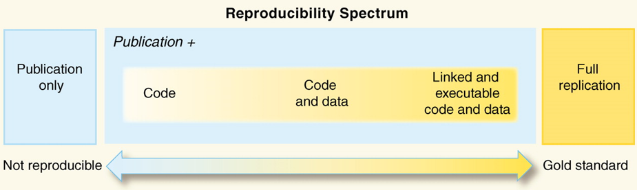
]


Nos acercamos a la reproducibilidad

--

Aún nos falta manejar las dependencias para llegar al estándar dorado ()

---

template:diapo-basica


# ¿Qué es Git y para qué sirve?

## ¿Cuándo sirve?

- Proyectos de código de naturaleza no lineal (ciclos de experimentación, código que evoluciona e itera, etc).
- Proyectos de código colaborativo.

--

## ¿Cuándo **no** sirve?

- Proyectos de desarrollo lineal (no hay necesidad de volver atrás).
- Proyectos que no estén basados en texto plano (por ejemplo, archivos .docx de Microsoft Word).
- Proyectos de muy baja complejidad (el costo de implementarlo resulta mayor al beneficio).


---
template:diapo-basica


# Principales conceptos

Git nos permite navegar de manera "sencilla" por las distintas versiones de un archivo

.center[

]

--

### Podemos rastrear dónde y cuándo se producen los errores

.center[

]


---

template:diapo-basica


# Estados en Git

.center[
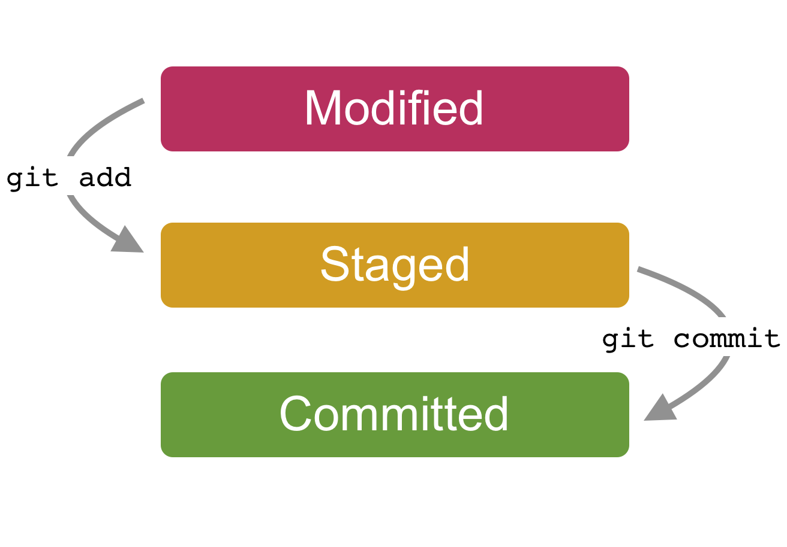
]

Tenemos 3 estados para nuestros archivos:

- Modificado

- "En escena" (*staging area*)

- Confirmado o comprometido (*committed*)

---

template:diapo-basica


# Principales conceptos

Ciclos sucesivos de *modificar, poner en escena y confirmar* van generando el historial de cambios de nuestro repositorio

--

Cada _commit_ es una foto del estado de nuestros archivos a la que podemos acceder cuando queramos

--

- **NO** podemos acceder a estados intermedios entre dos _commit_

--

- Queremos hacer _commit_ frecuentemente y con un número de cambios manejable

--

Si quiero trabajar de manera individual, no necesito más que lo que hemos visto hasta ahora

--

**¿Qué pasa si necesito trabajar con más personas?**


---

template:diapo-basica


# Principales conceptos

.center[
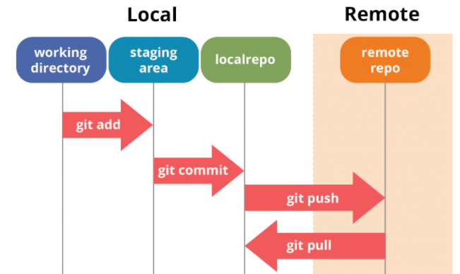
]

--

### Git puede funcionar sin problemas de manera local

--

### Gitlab, Github, etc se usan para trabajar con más personas


---

template:diapo-basica


# Principales conceptos

.center[

]


.right[ <font size="2"> Ilustración por Allison Horst, https://allisonhorst.com/git-github</font> ]


---
template:diapo-basica


# Repositorio remoto

.center[
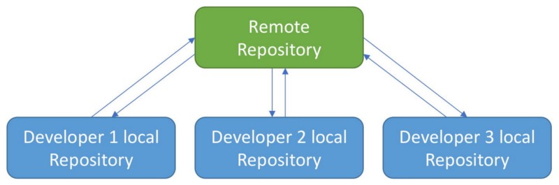
]

--

### Varias personas aportan a un mismo repositorio


.pull-left[
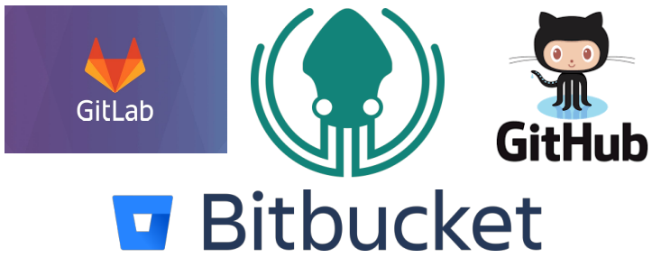
]

--

.pull-right[
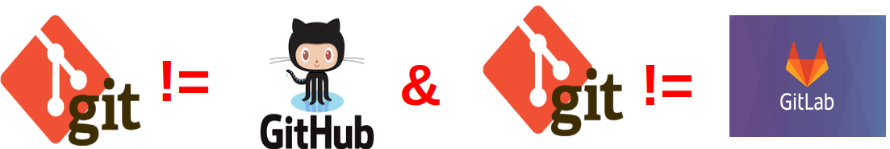
]


---
template:diapo-basica


# Esquema de trabajo en Git


.center[

]


Los commit nos permiten sujetarnos a la roca 

--

En terreno peligroso, es mejor hacer más commits.  

--

Si nos caemos, tendremos un punto del cual sujetarnos


---
template:diapo-basica


# Esquema de trabajo en Git

Luego de hacer nuestros _commit_, usualmente vamos a querer enviarlos al repositorio
remoto para que el resto pueda verlos a través de un _push_

--

Antes de hacer un _push_, es necesario actualizar nuestro proyecto con los cambios que otros/as colegas puedan haber realizado desde la última vez que nos sincronizamos con el repositorio remoto. Para esto, usamos `git pull`

--

Si es que fue posible traer los cambios remotos **sin problemas** y teniendo seguridad que nuestro código funciona, procedemos a empujar nuestros cambios con un `git push`

--

Por lo tanto, el flujo normal de trabajo es siempre:


## commit - pull - push

--

<div style="float: left;">

</div>


--

<!--  EJERCICIO 1 -->

**Probemos nuestro primer flujo `git`! ** 


---
template: diapo-basica

# ¿Sin problemas?

Al hacer `pull` traemos los cambios que han hecho el resto de colegas a nuestro
repositorio local y `git` trata de incorporarlo con los `commit` que hemos realizado
desde la última vez que hicimos `pull`. A esto se le llama `merge`.

--

Si los cambios que existen en nuestros `commit` no tienen intersección con los de
los `commit` de nuestros colegas, no habrá problema. Dos casos:

--

- Cambios en archivos diferentes

--

- Cambios en el mismo archivo, pero distintas líneas

--

Ahora, si nuestros `commit` y algún `commit` recibido en el `pull` cambian la misma
línea de un archivo, tendremos .red[problemas]: un conflicto de _merge_.

--

.center[
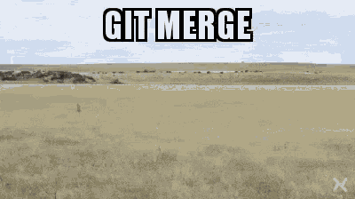
]

--

<!-- EJERCICIO 2 -->
**Probemos cómo generar y resolver un conflicto de merge**

---
template:diapo-basica

# Conflicto de merge

<div style="float: left;">
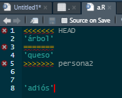
</div>


<-- Su script se verá similar a esto

--


Básicamente `git` nos muestra cómo están las líneas que tienen cambios simultáneos en nuestro repositorio y en el script en el repositorio remoto. 

Aquí debemos editar el script para que quede funcional, de acuerdo a los objetivos del proyecto y del script. Para esto no existe receta, podrían mantenerse ambos cambios, uno de los dos o ninguno:

--

.center[
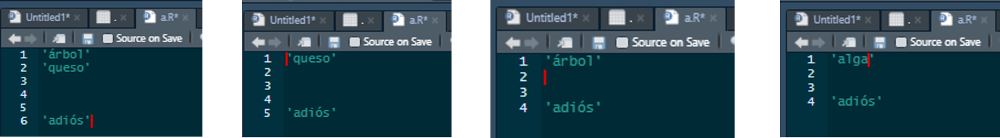
]

--

Luego de editar el script, es necesario realizar un `commit` y luego un `push` con lo que se soluciona el conflicto de `merge`.

--

**Nota importante:** cuando hacemos un `pull` con conflicto de `merge`, nos aparecerán todos los cambios al repositorio que ha habido desde la última vez que hicimos `pull`  en la pestaña Git. Solo debemos preocuparnos por los archivos que aparezcan con un símbolo de “U”, que implican que ese archivo específico tiene conflicto de merge.


---
template:diapo-basica

# Conflicto de merge

Ejemplo de lo anterior:

.center[
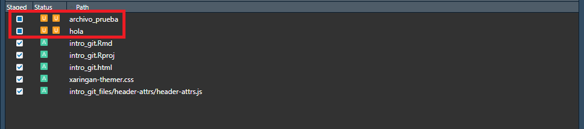
]

La terminal también nos indicará los archivos con conflicto:

.center[
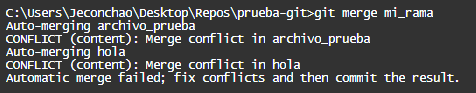
]

---
template:diapo-basica

# El árbol de commits


<div style="float: right;">
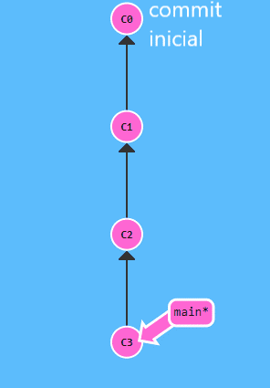
</div>


.texto-chico[El árbol de commits es una representación visual de la historia de nuestro proyecto.]

--

.texto-chico[Nos muestra cada commit, nos permite acceder a sus contenidos y nos muestra dónde nos encontramos actualmente en la historia del árbol y dónde se encuentran las otras ramas, en caso de existir.] 

--

.texto-chico[**¿Qué es una rama?** ]
--
.texto-chico[Simplemente es un puntero a un `commit` específico, que contiene la información de sus ancestros. ]


---
template:diapo-basica

# El árbol de commits


<div style="float: right;">
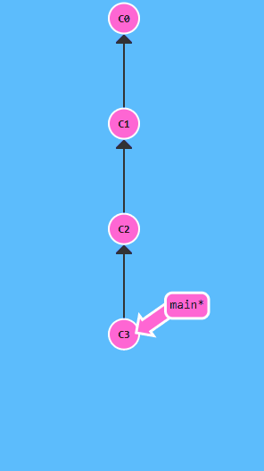
</div>


.texto-chico[El árbol de commits es una representación visual de la historia de nuestro proyecto.]


.texto-chico[Nos muestra cada commit, nos permite acceder a sus contenidos y nos muestra dónde nos encontramos actualmente en la historia del árbol y dónde se encuentran las otras ramas, en caso de existir.] 


.texto-chico[**¿Qué es una rama?** ]
.texto-chico[Simplemente es un puntero a un `commit` específico, que contiene la información de sus ancestros. ]


.texto-chico[ Si nos encontramos parados en una rama y realizamos un `commit` el puntero de la rama se moverá al commit más reciente.]


---
template:diapo-basica

# El árbol de commits


<div style="float: right;">
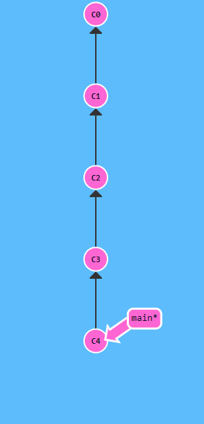
</div>


.texto-chico[El árbol de commits es una representación visual de la historia de nuestro proyecto.]


.texto-chico[Nos muestra cada commit, nos permite acceder a sus contenidos y nos muestra dónde nos encontramos actualmente en la historia del árbol y dónde se encuentran las otras ramas, en caso de existir.] 


.texto-chico[**¿Qué es una rama?** ]
.texto-chico[Simplemente es un puntero a un `commit` específico, que contiene la información de sus ancestros. ]


.texto-chico[ Si nos encontramos parados en una rama y realizamos un `commit` el puntero de la rama se moverá al commit más reciente.]

.texto-chico[La rama principal se llama main o master, que aloja la versión oficial de nuestro proyecto, pero podemos crear tantas como queramos]
---
template:diapo-basica

# El árbol de commits


<div style="float: right;">
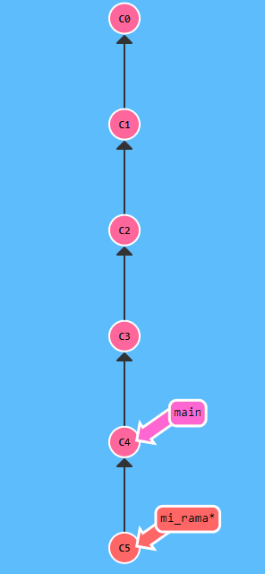
</div>


.texto-chico[El árbol de commits es una representación visual de la historia de nuestro proyecto.]


.texto-chico[Nos muestra cada commit, nos permite acceder a sus contenidos y nos muestra dónde nos encontramos actualmente en la historia del árbol y dónde se encuentran las otras ramas, en caso de existir.] 


.texto-chico[**¿Qué es una rama?** ]
.texto-chico[Simplemente es un puntero a un `commit` específico, que contiene la información de sus ancestros. ]


.texto-chico[ Si nos encontramos parados en una rama y realizamos un `commit` el puntero de la rama se moverá al commit más reciente.]

.texto-chico[La rama principal se llama main o master, que aloja la versión oficial de nuestro proyecto, pero podemos crear tantas como queramos]

.texto-chico[Todo software presenta alguna forma de acceder a este árbol; en el caso de Rstudio nos da acceso en Tools -> Version control -> History.]

--

**¡Veamos el árbol de _commits_ de nuestro proyecto actual!**


---
template:diapo-basica

# Trabajando con ramas

Es la forma más segura de trabajar en git: nuestro trabajo no tocará la rama principal hasta que lo decidamos

--

Cada desarrollador puede trabajar en una rama independiente, sin molestar a los demás

--

En proyectos grandes, los desarrolladores **en general** no tienen permiso para empujar directamente a la rama main/master, tienen que "pedir permiso" para hacerlo 

--

Existe un administrador encargado de revisar y unir (`merge`) las contribuciones a la rama central

- Decide si el aporte debe incorporarse 

- Resuelve conflictos

--

Por ahora nos centraremos en el caso básico en que tenemos total libertad de hacer
`commit`, `push` y `pull`

--

**¡Creemos nuestras primeras ramas!**

---
template:diapo-basica


# El .gitignore

Cuando trabajamos con repositorios remotos, muchas veces existen archivos que queremos mantener solo en nuestro computador o que no son realmente compatibles con un repositorio git, por lo que no queremos subirlos a la nube:


<div style="float: right;">
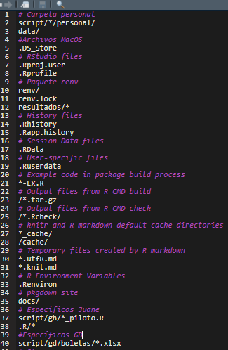
</div>

--

- Archivos que no son pertinentes al objetivo del proyecto.

--

- Archivos temporales y de caché.

--

- Archivos personales (por ejemplo, .Rprofile, scripts de pruebas).

--

- Archivos muy grandes (por ejemplo, tablas de datos pesadas).

--

Estos los anotamos en el archivo .gitignore, que es un archivo de texto simple.

--

**Importante:** .gitignore tiene algunas notaciones particulares, pero lo más relevante es que  el * sirve como comodín

--

**¡Hagamos pruebas de uso del .gitignore!** 


---
template:diapo-basica


# Recomendaciones sobre cómo interactuar con git

Revisamos cómo interactuar con git a través de la terminal y RStudio

--

**¿Cuál es mejor?** 
--
No hay una respuesta correcta, depende de cada persona. La botonera es más sencilla, pero, por lo mismo, más incompleta y menos transparente.

--

Recomendación general: si es que les acomoda, para operaciones más sencillas (`add`, `commit`, `push`, `pull`), la botonera de RStudio basta. Si queremos dar un uso más avanzado, la terminal puede darnos más control.

--

Existen alternativas intermedias como GitKraken, que proporcionan una interfaz de usuario enfocada en git, permitiendo más operaciones que las posibles en la botonera de RStudio. Tarea para la casa.

---

template:diapo-basica


# Torpedo

**git add .**: poner todo en escena

**git commit -m "mensaje personalizado"**: confirmar cambios

**git push nombre_rama**: empujar a rama remota

**git clone url_repositorio**: clonar un repositorio

**git pull nombre_rama**: traer cosas del repositorio

**git checkout nombre_rama**: ir a una rama

**git branch**: ver todas las ramas

**git branch nombre_rama**: crear una rama


---
template:diapo-basica


# Material de consulta

[Guía muy completa en español](https://git-scm.com/book/es/v2)

[Git con enfoque en R](https://happygitwithr.com/)


---

template: portada

---

template:diapo-basica


# Ejemplo de uso 


.pull-center[
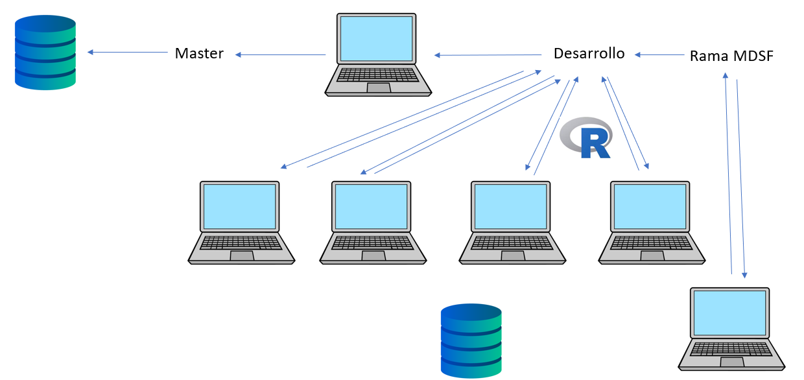
]


